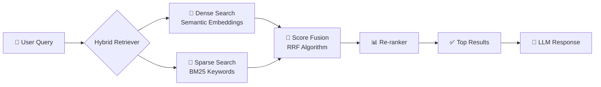

<div align="center">


<br/>

[](https://www.python.org/)
[](https://fastapi.tiangolo.com/)
[](https://tailwindcss.com/)
[](https://nodejs.org/)
[](LICENSE)

<br/>

> **🔍 ابحث عن وظيفتك أو تدريبك المثالي في السوق المصري بذكاء اصطناعي حقيقي**
> 
> نظام **Hybrid RAG** يجمع بين البحث الدلالي (Semantic Search) والبحث النصي الدقيق (BM25)

<br/>

</div>

---

## ✨ المميزات

<table>
<tr>
<td width="50%">

### 🧠 ذكاء اصطناعي متقدم
- **Hybrid RAG** يجمع Dense + Sparse Retrieval
- تضمينات دلالية (Semantic Embeddings) للفهم العميق
- إعادة ترتيب النتائج (Re-ranking) لدقة أعلى

</td>
<td width="50%">

### 🎯 مخصص للسوق المصري
- قاعدة بيانات وظائف وتدريبات محلية
- دعم البحث باللغتين العربية والإنجليزية
- تصفية حسب المجال والمستوى والموقع

</td>
</tr>
<tr>
<td width="50%">

### ⚡ أداء عالي
- API سريع مبني على **FastAPI**
- استجابة فورية مع streaming
- معالجة متوازية للاستعلامات

</td>
<td width="50%">

### 🎨 واجهة أنيقة
- تصميم حديث بـ **Tailwind CSS**
- تجربة مستخدم سلسة وبسيطة
- متجاوب مع جميع الأجهزة

</td>
</tr>
</table>

---

## 🏗️ المعمارية

```
Jobs-Internships-Hybrid-RAG-finder/
│
├── 📁 API/
│   └── main.py              # FastAPI entry point
│
├── 📁 src/
│   └── css/
│       ├── input.css        # Tailwind source
│       └── output.css       # Compiled CSS
│
├── ⚙️  setup.py              # One-time setup script
└── 📄 README.md
```

---

## 🚀 تشغيل المشروع

### المتطلبات

| أداة | الإصدار |
|------|---------|
| 🐍 Python | `3.10+` |
| 📦 Node.js | `LTS` |
| 🔧 pip | `latest` |

---

### الخطوة 1 — استنساخ المشروع

```bash
git clone https://github.com/Hazem-nabil42/Jobs-Internships-Hybrid-RAG-finder.git
cd Jobs-Internships-Hybrid-RAG-finder
```

### الخطوة 2 — الإعداد الأولي (مرة واحدة فقط ✅)

```bash
python setup.py
```

> 📌 هذا الأمر يثبّت جميع المكتبات المطلوبة ويهيئ البيئة تلقائيًا.

### الخطوة 3 — بناء Tailwind CSS

```bash
npx tailwindcss -i ./src/css/input.css -o ./src/css/output.css
```

### الخطوة 4 — تشغيل الخادم

```bash
uvicorn API.main:app --reload
```

### الخطوة 5 — افتح المتصفح 🌐

```
http://localhost:8000
```

---

## 🔬 كيف يعمل النظام؟



---

## 📡 API Endpoints

| Method | Endpoint | الوصف |
|--------|----------|-------|
| `GET` | `/` | الصفحة الرئيسية |
| `POST` | `/search` | البحث عن وظائف / تدريبات |
| `GET` | `/health` | التحقق من حالة الخادم |

---

## 🛠️ التقنيات المستخدمة

<div align="center">

| الطبقة | التقنية |
|--------|---------|
| 🔙 Backend | FastAPI · Python 3.10+ |
| 🎨 Frontend | HTML · Tailwind CSS |
| 🧠 RAG Engine | LangChain · FAISS / Chroma |
| 📐 Embeddings | Sentence-Transformers |
| 🔍 Sparse Search | BM25 (rank_bm25) |
| ⚡ Server | Uvicorn |

</div>

---

## 🤝 المساهمة

المساهمات مرحب بها! 🙌

```bash
# 1. Fork the repo
# 2. Create your branch
git checkout -b feature/amazing-feature

# 3. Commit your changes
git commit -m "feat: add amazing feature"

# 4. Push and open a Pull Request
git push origin feature/amazing-feature
```

---

## 📄 الرخصة

هذا المشروع مرخص تحت رخصة [MIT](LICENSE) — استخدمه بحرية ✨

---

<div align="center">


**صُنع بـ ❤️ لدعم الباحثين عن عمل في مصر**

⭐ إذا أعجبك المشروع، لا تنسَ تضع نجمة!

[](https://github.com/Hazem-nabil42/Jobs-Internships-Hybrid-RAG-finder)

</div>
