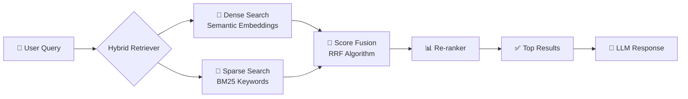

<div align="center">


## 🚀 تشغيل المشروع

### المتطلبات

| أداة | الإصدار |
|------|---------|
| 🐍 Python | `3.10+` |
| 📦 FastAPI | `LTS` |
| 🔧 pip | `latest` |

---

### الخطوة 1 — استنساخ المشروع

```bash
git clone https://github.com/Hazem-nabil42/Jobs-Internships-Hybrid-RAG-finder.git
cd Jobs-Internships-Hybrid-RAG-finder
```

### الخطوة 2 — الإعداد الأولي (مرة واحدة فقط ✅)

```bash
python setup.py
```

> 📌 هذا الأمر يثبّت جميع المكتبات المطلوبة ويهيئ البيئة تلقائيًا.

### الخطوة 3 — بناء Tailwind CSS

```bash
npx tailwindcss -i ./src/css/input.css -o ./src/css/output.css
```

### الخطوة 4 — تشغيل الخادم

```bash
uvicorn API.main:app --reload
```

### الخطوة 5 — افتح المتصفح 🌐

```
http://localhost:8000
```

---

## 🔬 كيف يعمل النظام؟



---

## 📡 API Endpoints

| Method | Endpoint | الوصف |
|--------|----------|-------|
| `GET` | `/` | الصفحة الرئيسية |
| `POST` | `/search` | البحث عن وظائف / تدريبات |
| `GET` | `/health` | التحقق من حالة الخادم |

---

## 🛠️ التقنيات المستخدمة

<div align="center">

| الطبقة | التقنية |
|--------|---------|
| 🔙 Backend | FastAPI · Python 3.10+ |
| 🎨 Frontend | HTML · Tailwind CSS |
| 🧠 RAG Engine | LangChain · FAISS / Chroma |
| 📐 Embeddings | Sentence-Transformers |
| 🔍 Sparse Search | BM25 (rank_bm25) |
| ⚡ Server | Uvicorn |

</div>

---

## 🤝 المساهمة

المساهمات مرحب بها! 🙌

```bash
# 1. Fork the repo
# 2. Create your branch
git checkout -b feature/amazing-feature

# 3. Commit your changes
git commit -m "feat: add amazing feature"

# 4. Push and open a Pull Request
git push origin feature/amazing-feature
```

---

## 📄 الرخصة

هذا المشروع مرخص تحت رخصة [MIT](LICENSE) — استخدمه بحرية ✨

---

<div align="center">


**صُنع بـ ❤️ لدعم الباحثين عن عمل في مصر**

⭐ إذا أعجبك المشروع، لا تنسَ تضع نجمة!

[](https://github.com/Hazem-nabil42/Jobs-Internships-Hybrid-RAG-finder)

</div>
